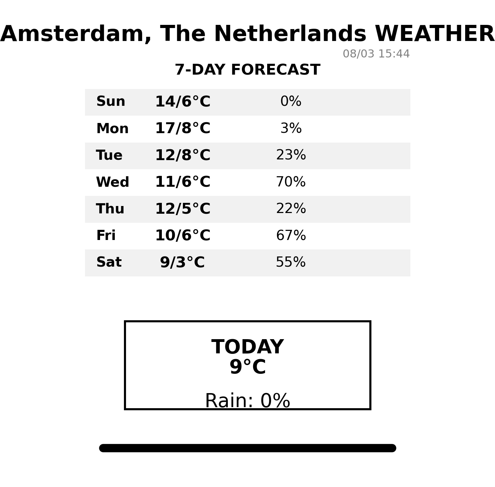

Fetch weather forecast and generate a static PNG file. Useful for Kindle and other e-paper devices to use a PNG file as a screensaver or background.

# Dependencies:
    python3-pip python3-matplotlib python3-requests python3-numpy

# Usage
  Example PNG "example/example-output.png" generated with the following parameters:

    python3 wftp.py amsterdam -o output.png -c cache.json

# Data sources

City coordinates lookup uses [open-meteo.com](https://open-meteo.com/) as primary data source, and [openstreetmap.org](https://www.openstreetmap.org/) as a fallback data source.

Weather lookup uses city coordinates to get the local weather via [open-meteo.com API](https://open-meteo.com/en/docs). 

# Cache

The script uses local cache to avoid excess load to the API server in case of user or cron error.

Default cache TLL is 5 minutes, configurable in CACHE_DURATION_MIN.

